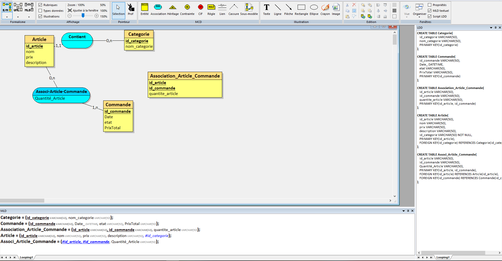

# **Projet : EatSmart**

**Etudiants :** Ikherbane Hedi Hamza

---

### **1. Description du projet**
 EatSmart est une application qui permet de passer commande a des restaurants en ligne. Les restaurateurs ont la possibilité de changer leur menu quand ils veulent et aussi indiquer la disponibilité de leur produits grace a une base de donnée

### **3. Fonctionnalités principales**

#### **3.1 Frontend (eatSmartFront)**

- **Fonctionnalité 1 :**  

  
- **Fonctionnalité 2 :**  
  Les utilisateurs peuvent consulter le menu, choisir les produits qu'ils souhaitent commander, et finaliser leur commande.
  
#### **3.2 Backend (eatSmartBack)**

- **Fonctionnalité 1 :**  
  Page de gestion de commande : Les utilisateurs peuvent consulter l'historique de leurs commandes, les détails des plats commandés, et l'état de leur commande.
  
- **Fonctionnalité 2 :**  
 Gestion des menus : Les restaurateurs peuvent ajouter, modifier ou supprimer des plats à tout moment. Les informations liées à chaque plat incluent le nom, la description, le prix et la disponibilité (par exemple, "en rupture de stock").)

---

### **4. Technologies utilisées**

- **Frontend :** PHP , JS , HTML , CSS
- **Backend :** PHP , API-Rest
- **Base de données :** MySQL

---
### **5. Schema Entites Relations**

## Endpoints de l'API

Adresse de l'API (en local) : http://localhosthedi-api-eatsmart/

Voici les différents endpoints de l'API : 
- `GET /articles` → Afficher la liste des articles
- `GET /articles/{id}` → Afficher l'article avec l'id égal à {id}
- `GET /categories` → Afficher la liste des catégories
- `GET /categories'/{id}` → Afficher la catégorie avec l'id égal à {id}
- `GET /commandes` → Afficher la liste des commandes
- `GET /categories/{id}`` → Afficher la commande avec l'id égal à {id}
